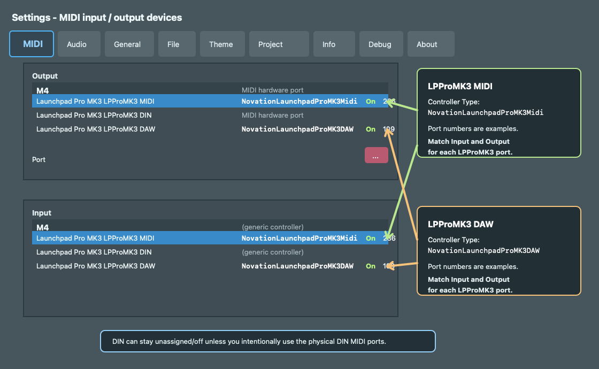

# FL Studio Launchpad Pro MK3 Midi/DAW Scripts

Unofficial FL Studio MIDI scripts for the Novation Launchpad Pro MK3.

The goal is to keep the Launchpad's normal Note, Chord, Sequencer, and Custom
Modes available while adding an FL Studio control surface that can be entered
from the Session button. Session switches into FL Control Mode. Press Session
again, or press Note, Chord, or Custom, to return to normal Launchpad operation.

This project is not affiliated with Image-Line, Novation, or Focusrite.

This script is developed from the original FL Studio Launchpad Pro MIDI script
shared on the Image-Line forum. The original script post is here:
[Image-Line forum: Launchpad Pro original script](https://forum.image-line.com/viewtopic.php?p=1494176#p1494176).
The original feature description is here:
[Image-Line forum: Novation Launchpad Pro feature guide](https://forum.image-line.com/viewtopic.php?f=1914&t=145029).

## Why There Are Two Scripts

Launchpad Pro MK3 exposes three USB MIDI interfaces:

- `LPProMK3 MIDI`: Note, Chord, Custom, Programmer Mode, and general MIDI.
- `LPProMK3 DAW`: DAW Session integration.
- `LPProMK3 DIN`: the physical DIN MIDI ports.

Session is only available when DAW Mode is enabled, so this project installs two
FL Studio controller scripts:

- `NovationLaunchpadProMK3Midi`: the main script for the `LPProMK3 MIDI` port.
- `NovationLaunchpadProMK3DAW`: a small helper for the `LPProMK3 DAW` port.

The DAW helper turns on Launchpad DAW Mode and forwards Session button events to
the main MIDI script. The main script then enters or exits FL Control Mode.

## FL Studio MIDI Setup

Quit FL Studio before installing or replacing the scripts.

Use the MIDI settings like this:



| FL Studio port | Controller Type | Enabled |
| --- | --- | --- |
| `Launchpad Pro MK3 LPProMK3 MIDI` | `NovationLaunchpadProMK3Midi` | On |
| `Launchpad Pro MK3 LPProMK3 DAW` | `NovationLaunchpadProMK3DAW` | On |
| `Launchpad Pro MK3 LPProMK3 DIN` | None or Generic | Off, unless you need DIN MIDI |

The port numbers in the image are only examples. The important rule is that each
Launchpad interface uses the same FL Studio port number on both Input and
Output. In other words, the `LPProMK3 MIDI` input and output should match each
other, and the `LPProMK3 DAW` input and output should match each other.

Do not assign `NovationLaunchpadProMK3Midi` to the DAW port, and do not assign
`NovationLaunchpadProMK3DAW` to the MIDI port. The two scripts have different
jobs and are meant to run together.

Enable the matching FL Studio output ports when you want LEDs, DAW Mode, and
layout switching to work reliably.

## Installation

### macOS Installer Script

The included installer script is macOS-only. It copies the scripts into the
default FL Studio user data folder under your macOS Documents folder.

Run this from the repository root:

```sh
./scripts/install-to-fl.sh
```

The installer copies the two script folders to:

```text
~/Documents/Image-Line/FL Studio/Settings/Hardware/NovationLaunchpadProMK3Midi
~/Documents/Image-Line/FL Studio/Settings/Hardware/NovationLaunchpadProMK3DAW
```

After installation, restart FL Studio and select the controller types shown in
the setup table above.

### Manual Installation

Use manual installation on Windows, when your FL Studio user data folder is in a
custom location, or when you do not want to use the macOS script.

1. Find your FL Studio user data folder in `Options > File settings > User data
   folder`.
2. Open the `FL Studio/Settings/Hardware` folder inside that user data folder.
   With FL Studio's default user data location this is usually:

   ```text
   macOS:
   ~/Documents/Image-Line/FL Studio/Settings/Hardware

   Windows:
   %USERPROFILE%\Documents\Image-Line\FL Studio\Settings\Hardware
   ```

3. Copy these repository folders into `Hardware`:

   ```text
   hardware/NovationLaunchpadProMK3Midi
   hardware/NovationLaunchpadProMK3DAW
   ```

4. The final installed folder names must be:

   ```text
   <User data folder>/FL Studio/Settings/Hardware/NovationLaunchpadProMK3Midi
   <User data folder>/FL Studio/Settings/Hardware/NovationLaunchpadProMK3DAW
   ```

5. Restart FL Studio.
6. Open `Options > MIDI settings`, then assign the `LPProMK3 MIDI` and
   `LPProMK3 DAW` input/output ports as shown in the MIDI setup section.

If you are replacing an older copy, remove the old installed
`NovationLaunchpadProMK3Midi` and `NovationLaunchpadProMK3DAW` folders before
copying the new ones.

## Mode Overview

| Mode | How to enter | What works |
| --- | --- | --- |
| Normal Launchpad operation | Start FL Studio, or leave FL Control Mode | Note, Chord, Sequencer, Custom Modes, and other Launchpad firmware features remain available. Most MIDI is passed through to FL Studio. |
| Note Mode | Press Note while outside FL Control Mode, or press Note while in FL Control Mode to exit | Launchpad's built-in Note/Drum layout sends notes to FL Studio. |
| Chord Mode | Press Chord while outside FL Control Mode, or press Chord while in FL Control Mode to exit | Launchpad's built-in Chord layout sends notes to FL Studio. |
| Custom Mode | Press Custom while outside FL Control Mode, or press Custom while in FL Control Mode to exit | Factory or Novation Components custom layouts send their MIDI directly to FL Studio. |
| FL Control Mode | Press Session | The script switches the Launchpad to Programmer Mode and controls the surface for FL Studio clip/performance control. |

On startup, the main MIDI script explicitly leaves Programmer Mode off. This
keeps the Launchpad usable as a normal instrument until you press Session.

## Normal Launchpad Operation

In normal operation, this script only intercepts Session because Session is used
as the FL Control Mode switch. Other Launchpad controls are left to the hardware
or passed through to FL Studio.

### Note Mode

Note Mode is the Launchpad's own Note/Drum layout. The script does not transform
notes in this mode, so FL Studio receives the musical MIDI generated by the
Launchpad.

### Chord Mode

Chord Mode is the Launchpad's own Chord layout. The script does not transform
chord output in this mode.

### Sequencer Mode

Sequencer Mode remains a Launchpad firmware feature in normal operation. The
script does not implement an FL Studio sequencer workflow.

### Custom Mode

Custom Mode is passed through to FL Studio. This is useful for Factory Custom
Modes and layouts made in Novation Components.

For example, Factory Custom Mode 1 sends CC fader data. Use FL Studio's normal
controller linking or MIDI learn features to map those CC messages to mixer
faders, plugin parameters, or other controls. The script does not consume or
reinterpret Custom Mode messages while outside FL Control Mode.

The last selected Custom page is remembered. If you enter FL Control Mode from a
Custom page and then press Custom to leave, the script returns to Custom Mode
instead of forcing Note Mode.

## FL Control Mode

Press Session to enter FL Control Mode.

When FL Control Mode is active, the main MIDI script:

- switches Launchpad Pro MK3 into Programmer Mode;
- clears and redraws the surface LEDs;
- uses the 8x8 pad grid for FL Studio live clip/performance control;
- uses the right scene-launch column and bottom track-control row as extra
  performance controls;
- forwards channel pressure and poly pressure as FL Studio special CC data;
- turns Programmer Mode off again when you leave.

Press Session again to return to the last remembered normal Launchpad mode.
Press Note, Chord, or Custom to leave FL Control Mode directly into that mode.

### 8x8 Pad Grid

The 8x8 grid launches FL Studio live clips or performance blocks. LED feedback is
driven by FL Studio's playlist/live clip state.

Velocity is preserved for clip triggering unless Velocity Lock is enabled. When
Velocity Lock is enabled, non-zero pad hits are forced to full velocity.

### Scene and Column Triggers

The script uses more than the central 8x8 grid in FL Control Mode:

- The right scene-launch column, CC `89`, `79`, `69`, `59`, `49`, `39`, `29`,
  and `19`, works as a row/track trigger area.
- The bottom track-control row, CC `1` through `8`, works as a column/scene
  trigger area.

These areas are part of the Launchpad Programmer layout, not the regular Note or
Custom layouts.

### Navigation

Navigation buttons move the visible FL control area:

| Button | Programmer CC | FL Control Mode function |
| --- | --- | --- |
| Left navigation | `91` | Move the clip/page offset left. Moving left before the first clip reaches track properties and custom map pages. |
| Right navigation | `92` | Move the clip/page offset right. |
| Up navigation | `80` | Move the track offset up. |
| Down navigation | `70` | Move the track offset down. |

Holding a navigation button repeats the movement. Holding all four navigation
buttons toggles page-sized movement and resets the offsets.

### Track Properties Page

Move left before clip slot 0 to reach the track properties page. On that page,
the 8x8 grid edits per-track live mode properties, including:

- position snap;
- trigger snap;
- loop mode;
- trigger mode.

The left side of the grid also displays track activity meters.

### FL Map Pages

Move further left to reach the bundled FL Studio map pages. These are inherited
from the original Launchpad-style FL Studio script layout files:

| Page file | Layout |
| --- | --- |
| `Page1.scr` | Chromatic Keyboard |
| `Page2.scr` | Melodic and Slicex layout |
| `Page3.scr` | FPC, 4 Selectors, 4 Faders |
| `Page4.scr` | 8 Faders vertical |
| `Page5.scr` | 8 Faders horizontal |
| `Page6.scr` | Gross Beat controller |
| `Page7.scr` | XY controller |
| `Page8.scr` | Aeolian layout |
| `Page9.scr` | Harmonic layout |
| `Page10.scr` | Tempo control |
| `Page11.scr` | System layout |

These pages are separate from Launchpad's hardware Custom Mode pages.

## Original FL Studio Launchpad Pro Features

This project is based on the original FL Studio Launchpad Pro script shared in
the Image-Line forum. Image-Line's Launchpad Pro feature guide describes that
controller as a clip launcher, note controller, parameter controller, and
user-scriptable page surface. This project keeps that FL Studio control-surface
behavior available in FL Control Mode, while leaving Launchpad Pro MK3's normal
hardware modes available outside FL Control Mode.

The original setup instructions refer to `MIDIIN2 (Launchpad Pro)` with matching
input and output port numbers. For Launchpad Pro MK3, use the MIDI setup shown
above instead:

- `LPProMK3 MIDI` is assigned to `NovationLaunchpadProMK3Midi`.
- `LPProMK3 DAW` is assigned to `NovationLaunchpadProMK3DAW`.
- The exact port numbers are local examples, but each interface must use the
  same number on Input and Output.

Feature compatibility with the visible Image-Line forum feature description:

| Original feature area | Status in this script |
| --- | --- |
| Clips / Performance zones | Preserved in FL Control Mode. The 8x8 grid launches FL Studio live clips and displays clip state. |
| Overview | Preserved in FL Control Mode. Overview shows 8x8 Playlist zones and lets you jump to a zone. |
| Navigation | Preserved in FL Control Mode. Navigation moves by clip/track increments; holding all four navigation buttons toggles page-sized movement and resets offsets. |
| Scene and +Scene | Preserved in FL Control Mode. These trigger column/group behavior and can be locked by double-tapping. |
| Queue | Preserved in FL Control Mode. Queue modifies the next triggered clips. |
| Global Snap | Preserved in FL Control Mode. Global Snap modifies clip triggering to use FL Studio's global snap. |
| Same Mode | Preserved in FL Control Mode through the combined Scene/+Scene trigger behavior inherited from the original script. |
| Track settings page | Preserved in FL Control Mode. It exposes track activity, position snap, trigger snap, loop mode, and trigger mode controls. |
| Pad pressure linking | Preserved in FL Control Mode. Channel pressure and poly pressure are converted to FL Studio special CC data for linking. |
| Note and controller pages | Preserved as bundled `.scr` map pages. These include chromatic, melodic, FPC, fader, Gross Beat, XY, tempo, and system layouts. |
| User-scriptable pages | Preserved through the inherited `Page*.scr`, `Palette.scr`, and `launchMapPages` workflow. |
| Transport controls on map pages | Preserved in the bundled pages. Several pages include Record, Overdub, Loop Recording, Metronome, Wait for Input, Step Edit, Previous Channel, and Next Channel entries. |
| Light show / animation mapping | Mostly preserved. MIDI note output can still drive pad animation modes and RGB-style animation data. The legacy video/pixel capture path is present in the code but is not guaranteed in this MK3 switching layout. |
| Alt Location | Not exposed as a documented MK3 hardware workflow in this project. Use navigation and overview/map-page selection instead. |

The main behavioral difference is when these features are active. The original
Launchpad Pro script behaves as a dedicated FL Studio surface. This MK3 version
uses Session as a mode switch: FL Studio control features are active in FL
Control Mode, and the Launchpad's native Note, Chord, Sequencer, and Custom
Modes are left available the rest of the time.

## Buttons Outside the 8x8 Grid

The table uses the Launchpad Pro MK3 Programmer layout numbers. Buttons outside
the 8x8 grid send Control Change messages in Programmer Mode.

| Hardware control | Programmer CC | Normal operation | FL Control Mode |
| --- | --- | --- | --- |
| Shift | `90` | Handled by Launchpad firmware where applicable | Not assigned by this script |
| Left navigation | `91` | Hardware or pass-through behavior | Clip/page offset left |
| Right navigation | `92` | Hardware or pass-through behavior | Clip/page offset right |
| Session | `93` | Enter FL Control Mode | Exit FL Control Mode |
| Note | `94` | Launchpad Note Mode | Exit to Note Mode |
| Chord | `95` | Launchpad Chord Mode | Exit to Chord Mode |
| Custom | `96` | Launchpad Custom Mode | Exit to Custom Mode |
| Sequencer | `97` | Launchpad Sequencer Mode | Scene/column launch modifier |
| Projects / Save | `98` | Launchpad Projects/Save behavior | Scene+ / column launch modifier |
| Novation logo LED | `99` | LED only | LED only, not a button |
| Up navigation | `80` | Hardware or pass-through behavior | Track offset up |
| Down navigation | `70` | Hardware or pass-through behavior | Track offset down |
| Clear | `60` | Hardware or pass-through behavior | Tap Tempo |
| Duplicate | `50` | Hardware or pass-through behavior | Tempo Nudge + |
| Quantise | `40` | Hardware or pass-through behavior | Tempo Nudge - |
| Fixed Length | `30` | Hardware or pass-through behavior | Velocity Lock |
| Play | `20` | Hardware or pass-through behavior | Sends a legacy Launchpad layout request; not mapped to FL Play |
| Record / Capture MIDI | `10` | Hardware or pass-through behavior | FL Studio Stop |
| Right scene-launch column | `89`, `79`, `69`, `59`, `49`, `39`, `29`, `19` | Hardware or pass-through behavior | Row/track trigger area |
| Bottom track-control row | `1` through `8` | Hardware or pass-through behavior | Column/scene trigger area |
| Track select row | `101` through `108` | Hardware or pass-through behavior | Not assigned by this script |
| Ableton track buttons outside CC `1` through `8` | Varies by layout | Hardware or pass-through behavior | Not assigned by this script |
| Setup | Hardware settings button | Opens Launchpad settings when the hardware allows it | Not handled while Programmer Mode is active; leave FL Control Mode first |

Some FL Control Mode button names come from the original FL Studio performance
script internals. If a hardware label and the FL action feel unrelated, the FL
action listed here is the behavior implemented by this script.

## Known Notes

- FL Control Mode uses Programmer Mode, so normal Launchpad firmware functions
  are temporarily unavailable until you leave FL Control Mode.
- Session requires DAW Mode. If the Session button does not light or does not
  respond, check that the `LPProMK3 DAW` input and output ports are enabled and
  assigned to `NovationLaunchpadProMK3DAW`.
- The `LPProMK3 DIN` port is not required unless you intentionally route MIDI
  through the Launchpad's DIN connectors.
- This script currently focuses on switching cleanly between Launchpad hardware
  modes and FL Studio performance control. It is not a full replacement for every
  Ableton-oriented control printed on the Launchpad surface.

## References

- [Image-Line forum: Launchpad Pro original script](https://forum.image-line.com/viewtopic.php?p=1494176#p1494176)
- [Image-Line forum: Novation Launchpad Pro feature guide](https://forum.image-line.com/viewtopic.php?f=1914&t=145029)
- [Launchpad Pro MK3 hardware overview](https://userguides.novationmusic.com/hc/en-gb/articles/25494505681042-Launchpad-Pro-MK3-hardware-overview)
- [Launchpad Pro MK3 Programmer's Reference Guide](https://fael-downloads-prod.focusrite.com/customer/prod/s3fs-public/downloads/LPP3_prog_ref_guide_200415.pdf)
- [Image-Line FL Studio MIDI settings](https://www.image-line.com/fl-studio-learning/fl-studio-online-manual/html/envsettings_midi.htm)
- [Image-Line FL Studio MIDI scripting](https://www.image-line.com/fl-studio-learning/fl-studio-beta-online-manual/html/midi_scripting.htm)
